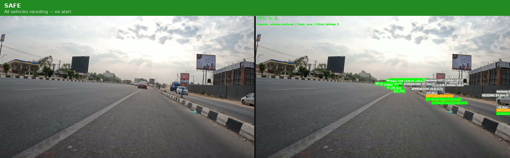
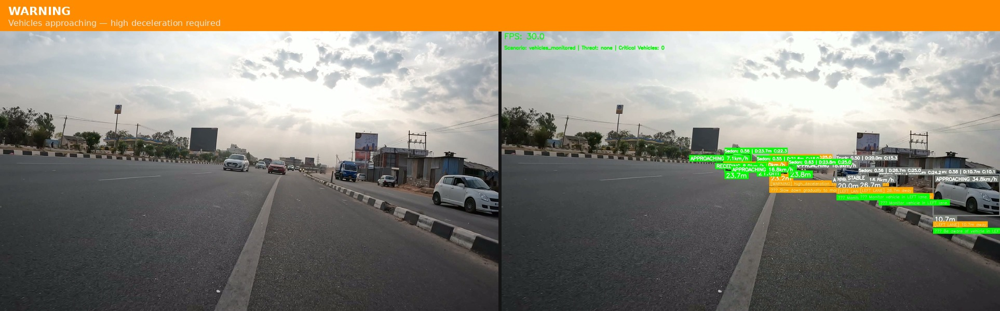
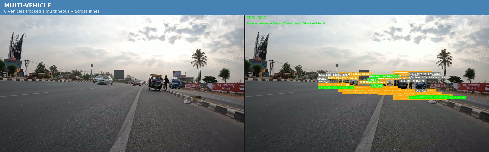
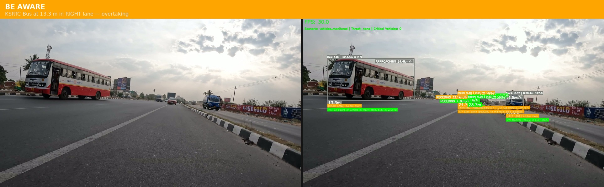
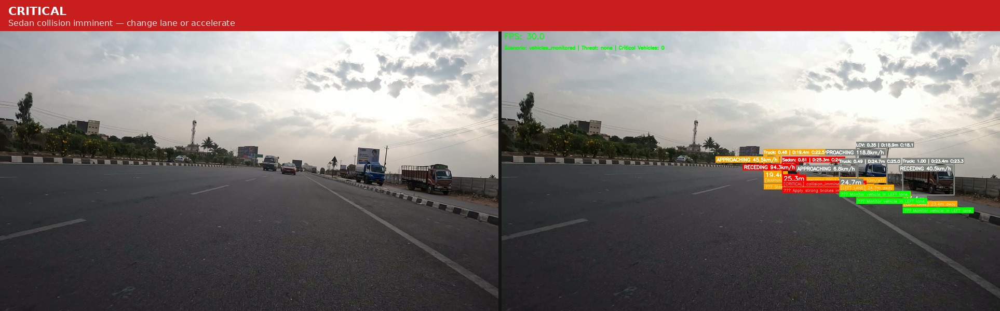
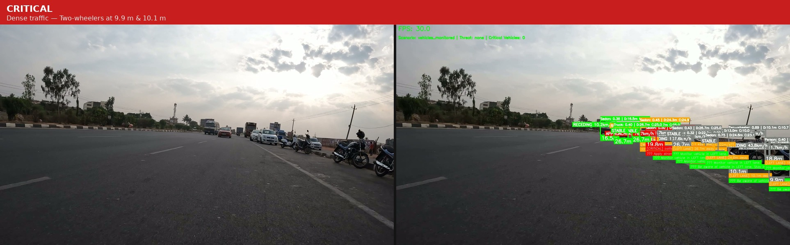

# Rear-View ADAS — Monocular Vision System

Real-time rear-side rider assistance for two-wheelers using a single rear-mounted RGB camera. Detects, classifies, and tracks surrounding vehicles; estimates metric depth; assesses collision risk via surrogate safety measures; and generates lane-aware rider recommendations — all at 27–54 FPS on embedded hardware.

> **Looking for the edge-device / Raspberry Pi 5 version?**
> This repository targets desktop GPUs and Jetson platforms.
> For the lightweight build optimised for Raspberry Pi 5 and other edge devices, see:
> **[Rear-View-ADAS-Monocular-Vision-System-Edge-Devices](https://github.com/Atulkumar0804/Rear-View-ADAS-Monocular-Vision-System-Edge-Devices)**

---

## Features

- **YOLOv11n detection** + **UVH-26 fine-grained vehicle classifier** (94.2% Top-1 accuracy, 15 Indian traffic categories)
- **Hybrid monocular depth estimation** — ground-plane projection + size-based ranging + motion parallax, periodically corrected by Depth Anything V2 / MiDaS (MAE 1.08 m overall)
- **ByteTrack multi-object tracking** with IoU fallback (61.7% fewer ID switches vs IoU-only)
- **Dynamic horizon estimation** — adapts to camera suspension pitch in real time
- **Lane-aware surrogate safety measures** — TTC, MTTC, PET, DRAC conditioned on lane assignment
- **Rider action recommendations** — emergency braking, deceleration, monitoring
- **Multi-platform support** — RTX A6000, Jetson Orin NX, Jetson Nano, Raspberry Pi 5
- **Intel RealSense D455** support for metric ground-truth depth

---

## Performance

| Platform | FPS | Depth MAE | Power |
|---|---|---|---|
| RTX A6000 | 54.1 | 1.08 m | 48 W |
| Jetson Orin NX | 27.0 | 1.08 m | 6.2 W |
| Jetson Nano (TRT INT8) | 21.4 | 1.18 m | 2.7 W |
| Raspberry Pi 5 | 16–20 | 1.32 m | 5.0 W |

Safety alert TPR: **93.3%** | FPR: **6.7%** (lane-aware filtering reduces FPR 2.6× vs proximity-only)

---

## Results

Each panel shows **Without Inference** (raw camera feed, left) vs **With Inference** (full ADAS overlay, right) side by side.  
Source: `relative_speed_50.mp4` — Indian mixed-traffic highway, 1920×1080, 30 FPS, processed on RTX A6000.

---

### SAFE — All vehicles receding, no alert
Sedans and Hatchbacks detected across lanes. All bounding boxes are green, motion state shows STABLE / RECEDING, no alert banner triggered. System correctly suppresses adjacent-lane vehicles (orange badges = monitor only).



---

### WARNING — Vehicles approaching, high deceleration required
Multiple Sedans approaching in the centre lane. Orange bounding boxes active, WARNING badge with high-deceleration DRAC annotation visible. Per-track distance badges and lane assignment shown. Rider instructed to speed up or prepare to change lane.



---

### MULTI-VEHICLE — 6 simultaneous tracks across 3 lanes
Dense mixed traffic — Sedans, Bus, Truck, Three-wheeler, Person tracked simultaneously. Each track carries its own distance badge, motion state, lane assignment, and independent safety assessment. Cross-lane suppression active on adjacent vehicles.



---

### BE AWARE — KSRTC Bus at 13.3 m, overtaking in RIGHT lane
Large bus at 13.3 m in the adjacent RIGHT lane approaching at 24.4 km/h. System correctly classifies it as an adjacent-lane event (orange badge) rather than a collision threat — rider is told to stay in lane, not to brake. Trucks in centre lane receive WARNING assessment simultaneously.



---

### CRITICAL — Sedan collision imminent, change lane or accelerate
Sedan at 25.3 m in the same lane with closing relative speed (Truck at 118.8 km/h approaching). Red CRITICAL badge visible with "collision_imminent" label and "Apply strong brakes" instruction overlay. Multiple trucks tracked in adjacent lanes simultaneously.



---

### CRITICAL — Dense traffic, Two-wheelers at 9.9 m and 10.1 m
Highest-density scene: 8+ vehicles tracked including Two-wheelers at 9.9 m and 10.1 m in the LEFT lane, Sedans and Trucks across all lanes. CRITICAL assessments on nearest vehicles, BE AWARE on fast-approaching adjacent vehicles. System maintains 30 FPS throughout.



---

### Run Statistics (`relative_speed_50.mp4`)

| Metric | Value |
|---|---|
| Input video | `relative_speed_50.mp4` — Indian highway, 1920×1080, 30 FPS |
| Duration | 30.8 seconds (~924 frames) |
| Processing platform | RTX A6000 (Xeon CPU, 48 GB) |
| Average FPS | 30.0 (real-time) |
| Vehicle classes detected | Sedan, Hatchback, Truck, Bus, LCV, Three-wheeler, Person |
| Peak simultaneous tracks | 8+ vehicles in a single frame |
| CRITICAL alerts | Same-lane vehicles within TTC < 1.0 s threshold |
| Adjacent-lane suppression | Active — overtaking vehicles suppressed from collision alerts |

---

## Repository Structure

```
CNN/
├── inference/                    # Core inference scripts
│   ├── camera_inference.py       # Live camera / real-time ADAS
│   ├── video_inference.py        # Offline video processing + CSV logging
│   ├── byte_tracker.py           # ByteTrack multi-object tracker
│   ├── jetson_depth_lite.py      # Async depth backend (DA2 / MiDaS)
│   ├── gpu_config.py             # GPU profile manager
│   ├── model_optimizer.py        # TensorRT / quantization helpers
│   ├── web_server.py             # Flask web interface
│   └── templates/index.html      # Web UI
│
├── scripts/                      # Training and calibration utilities
│   ├── zoedepth_loader.py        # ZoeDepth model loader
│   ├── train_depth_kitti.py      # Depth model fine-tuning
│   ├── calibrate_camera.py       # Camera intrinsic calibration
│   ├── download_zoedepth.py      # Download ZoeDepth weights
│   └── ...
│
├── models/                       # Model weights (NOT in git — download separately)
│   ├── classifier/weights/best.pt        # UVH-26 fine-grained classifier
│   ├── depth_lite/                       # Lightweight KITTI-metric depth models
│   │   ├── da2_kitti_metric.onnx
│   │   └── midas_kitti_metric.onnx
│   ├── depth_anything_v2/                # Depth Anything V2 base weights
│   └── depth_anything_v2_finetuned/      # Fine-tuned DA2 weights
│
├── Documents/                    # Technical documentation
│   ├── CAMERA_INFERENCE.md       # camera_inference.py reference
│   ├── VIDEO_INFERENCE.md        # video_inference.py reference
│   └── MODEL_TRAINING_EVALUATION.md
│
├── requirements.txt              # Python dependencies
├── main.sh                       # Convenience launcher
├── Dockerfile                    # Docker deployment
└── docker-compose.web.yml        # Docker Compose for web interface
```

> **Note:** `dataset/`, `testing_data/`, model weight files (`*.pt`, `*.onnx`, `*.safetensors`), and personal documents are excluded from git via `.gitignore`.

### Testing Video Dataset

The testing videos used in the results above are available for download from Google Drive:

**[Download Testing Dataset (Google Drive)](https://drive.google.com/drive/folders/1M3XMaNEwHySBKchR0o6APdtSVhM5PcPI?usp=sharing)**

Place the downloaded videos in `testing_data/` before running inference:

```bash
mkdir -p testing_data
# Move downloaded videos into testing_data/
python3 inference/video_inference.py --input testing_data/relative_speed_50.mp4 --output result.mp4
```

### Training Datasets

| Dataset | Purpose | Download |
|---|---|---|
| **UVH-26** | Fine-grained vehicle classification (26 categories, Indian mixed traffic) | **[Download UVH-26 (Kaggle)](https://www.kaggle.com/datasets/dataclusterlabs/indian-vehicle-dataset)** |
| **KITTI Depth** | Metric depth model training and evaluation | **[Download KITTI Depth (Official)](https://www.cvlibs.net/datasets/kitti/eval_depth.php?benchmark=depth_prediction)** |

After downloading, place them as follows:

```
dataset/
├── uvh26_cls/          # UVH-26 classification dataset
│   ├── train/
│   ├── val/
│   └── test/
└── kitti_depth/        # KITTI depth dataset
    ├── train/
    └── val/
```

The KITTI depth dataset can also be downloaded using the provided script:

```bash
bash scripts/download_kitti_depth.sh
```

---

## Prerequisites

- Python 3.9 or 3.10
- CUDA 11.8+ (for GPU inference; CPU mode also supported)
- PyTorch 2.1+
- OpenCV 4.8+
- 8 GB RAM minimum (16 GB recommended for full pipeline)
- For Jetson: JetPack 5.1+, CUDA Toolkit pre-installed

---

## Installation

### 1. Clone the repository

```bash
git clone https://github.com/Atulkumar0804/Rear-View-ADAS-Monocular-Vision-System.git
cd Rear-View-ADAS-Monocular-Vision-System
```

### 2. Create and activate a virtual environment

```bash
python3 -m venv .venv
source .venv/bin/activate          # Linux / macOS
# .venv\Scripts\activate           # Windows
```

### 3. Install Python dependencies

```bash
pip install --upgrade pip
pip install -r requirements.txt
```

`requirements.txt` installs: `ultralytics`, `torch`, `torchvision`, `opencv-python`, `numpy`, `transformers`, `accelerate`, `flask`, and optional `pyrealsense2`.

### 4. Download model weights

Model weights are not stored in git due to size. Download them using the provided scripts or manually place them in the `models/` directory.

#### Option A — Automatic download scripts

```bash
# Download ZoeDepth / DA2 base weights
python3 scripts/download_zoedepth.py

# Download KITTI depth dataset (for retraining only)
# bash scripts/download_kitti_depth.sh
```

#### Option B — Direct download from GitHub Releases

Download each file and place it at the exact path shown:

| File | Size | Destination path | Download |
|---|---|---|---|
| `yolo11n.pt` | ~6 MB | `yolo11n.pt` (root) | Auto-downloaded by Ultralytics on first run |
| `best.pt` | 20 MB | `models/classifier/weights/best.pt` | [Download](https://github.com/Atulkumar0804/Rear-View-ADAS-Monocular-Vision-System/releases/download/v1.0-models/best.pt) |
| `da2_kitti_metric.onnx` | 95 MB | `models/depth_lite/da2_kitti_metric.onnx` | [Download](https://github.com/Atulkumar0804/Rear-View-ADAS-Monocular-Vision-System/releases/download/v1.0-models/da2_kitti_metric.onnx) |
| `midas_kitti_metric.onnx` | 95 MB | `models/depth_lite/midas_kitti_metric.onnx` | [Download](https://github.com/Atulkumar0804/Rear-View-ADAS-Monocular-Vision-System/releases/download/v1.0-models/midas_kitti_metric.onnx) |
| DA2 base model | ~98 MB | `models/depth_anything_v2/` | HuggingFace: `depth-anything/Depth-Anything-V2-Small-hf` |

Or download all at once using `wget`:

```bash
mkdir -p models/classifier/weights models/depth_lite

wget -O models/classifier/weights/best.pt \
  https://github.com/Atulkumar0804/Rear-View-ADAS-Monocular-Vision-System/releases/download/v1.0-models/best.pt

wget -O models/depth_lite/da2_kitti_metric.onnx \
  https://github.com/Atulkumar0804/Rear-View-ADAS-Monocular-Vision-System/releases/download/v1.0-models/da2_kitti_metric.onnx

wget -O models/depth_lite/midas_kitti_metric.onnx \
  https://github.com/Atulkumar0804/Rear-View-ADAS-Monocular-Vision-System/releases/download/v1.0-models/midas_kitti_metric.onnx
```

#### Option C — From GitHub Releases

See all releases at: [github.com/Atulkumar0804/Rear-View-ADAS-Monocular-Vision-System/releases](https://github.com/Atulkumar0804/Rear-View-ADAS-Monocular-Vision-System/releases)

### 5. Verify setup

```bash
python3 -c "import torch; print('CUDA:', torch.cuda.is_available())"
python3 -c "from ultralytics import YOLO; print('Ultralytics OK')"
```

---

## Running the System

> **Always activate the virtual environment before running anything.**

```bash
source .venv/bin/activate
```

The recommended way to run the system is via the interactive launcher:

```bash
bash main.sh
```

This handles Python path, venv detection, and GPU profile automatically. The full flow is described below.

---

## main.sh — Step-by-Step Walkthrough

### Step 1 — Select GPU Profile

```
================================================================
  REAR-VIEW ADAS - MAIN LAUNCHER
================================================================

Select GPU Profile:

  1. RTX A6000        (Full Performance)
  2. Jetson Nano      (Restricted - 8 GB memory)
  3. Jetson Nano      (Power Save - 7 W)

Enter GPU profile [1-3, default: 1]:
```

| Choice | Profile | Use when |
|---|---|---|
| `1` | `a6000_full` | Desktop / workstation GPU (default) |
| `2` | `jetson_nano_restricted` | Jetson Nano, 8 GB RAM limit |
| `3` | `jetson_nano_power_save` | Jetson Nano, battery / 7 W mode |

Press `Enter` to use the default (RTX A6000).

---

### Step 2 — Select Mode

```
Select mode:

  1. Camera Detection   (Real-time inference on live camera)
  2. Video Processing   (Offline inference on a video file)
  3. Train Models       (Fine-tune classifier or depth model)
  4. Exit
```

---

### Mode 1 — Camera Detection (Real-time)

Select `1`. You will then be asked for the camera source:

```
  1. USB / V4L2 Camera
  2. Test Video (use a local video file as input)
```

**Sub-option 1 — USB / V4L2 Camera:**

```
Enter camera index [default: 4]:
```

- Type `4` + Enter → uses camera `4`
- Type `2` + Enter → uses camera `2`
- Type `0` + Enter → uses camera `0`
The annotated live feed is displayed in a window and saved to `detection_output_camera.mp4`.

> **Tip:** Run `ls /dev/video*` in a terminal to list available camera devices.  
> Press `q` or `ESC` to stop. Session FPS stats are printed on exit.

**Sub-option 2 — Test Video as Camera Input:**

```
Enter video file path: testing_data/relative_speed_50.mp4
```

Runs `camera_inference.py` on the video file and saves output as `<name>_camera_result.mp4`.

---

### Mode 2 — Video Processing (Offline)

Select `2`. Enter the path to your video file when prompted:

```
Enter input video path: testing_data/relative_speed_50.mp4
```

Runs `video_inference.py` which produces:
- `<input_name>_detected.mp4` — fully annotated output video with ADAS overlays
- A CSV telemetry log alongside the video with per-frame safety metrics

Example session output:

```
Video Processing  |  GPU Profile: a6000_full
  Input : testing_data/relative_speed_50.mp4
  Output: testing_data/relative_speed_50_detected.mp4

Starting video_inference ...

Frame 924/924 (100.0%) - 36.8 FPS

Processing complete!
  Frames   : 924
  Avg FPS  : 36.8
  Output   : testing_data/relative_speed_50_detected.mp4
```

> For detailed tuning options (depth interval, classical weight, ego speed) see [Documents/VIDEO_INFERENCE.md](Documents/VIDEO_INFERENCE.md).

---

### Mode 3 — Train Models

Select `3` to launch the classifier training script.  
Requires the UVH-26 dataset placed in `dataset/uvh26_cls/` — see [Training Datasets](#training-datasets) above.

---

## Docker Deployment

```bash
# Build and run with Docker
docker build -t rear-adas .
docker run --gpus all -p 5000:5000 rear-adas

# With Docker Compose (web interface)
docker-compose -f docker-compose.web.yml up
```

The web interface streams the annotated ADAS output to any browser on `http://<host-ip>:5000`.

---

## Environment Variables

| Variable | Default | Description |
|---|---|---|
| `ADAS_DEVICE` | `cuda` | Override inference device |
| `ADAS_PROFILE` | `a6000_full` | GPU profile for optimization |
| `ADAS_LOG_LEVEL` | `INFO` | Logging verbosity |

---

## Documentation

| Document | Description |
|---|---|
| [Documents/CAMERA_INFERENCE.md](Documents/CAMERA_INFERENCE.md) | Full reference for `camera_inference.py` — all classes, arguments, HUD layout |
| [Documents/VIDEO_INFERENCE.md](Documents/VIDEO_INFERENCE.md) | Full reference for `video_inference.py` — hybrid depth, CSV schema, tuning |
| [Documents/MODEL_TRAINING_EVALUATION.md](Documents/MODEL_TRAINING_EVALUATION.md) | UVH-26 and depth model training details |
| [inference/GPU_CONFIG_GUIDE.md](inference/GPU_CONFIG_GUIDE.md) | GPU profile selection and TensorRT setup |

---

## Scripts Reference

| Script | Purpose |
|---|---|
| `scripts/calibrate_camera.py` | Checkerboard camera calibration (intrinsics) |
| `scripts/calibrate_distance_interactive.py` | Interactive distance calibration with known objects |
| `scripts/train_depth_kitti.py` | Fine-tune DA2 depth model on KITTI |
| `scripts/train_depth_da2_kitti.py` | Alternative DA2 training script |
| `scripts/download_zoedepth.py` | Download ZoeDepth model weights |
| `scripts/export_jetson.py` | Export models to TensorRT for Jetson |
| `scripts/DEPTH_ACCURACY_EVALUATION.py` | Evaluate depth MAE vs ground truth |
| `scripts/zoedepth_loader.py` | ZoeDepth / DA2 model loading utility |

---

## Troubleshooting

**No CUDA device found:**
```bash
python3 -c "import torch; print(torch.cuda.device_count())"
# If 0, install CUDA-enabled PyTorch:
pip install torch torchvision --index-url https://download.pytorch.org/whl/cu118
```

**Camera not found:**
```bash
v4l2-ctl --list-devices        # Linux
# Try different camera index: --camera 1, --camera 2
```

**YOLO model not found:**
```bash
# yolo11n.pt auto-downloads on first run. If it fails, download manually:
python3 -c "from ultralytics import YOLO; YOLO('yolo11n.pt')"
```

**Classifier weights missing:**
```
FileNotFoundError: models/classifier/weights/best.pt
```
Download `best.pt` from the [Releases page](https://github.com/Atulkumar0804/Rear-View-ADAS-Monocular-Vision-System/releases/download/v1.0-models/best.pt) and place at `models/classifier/weights/best.pt`.

**ByteTracker import error:**
```
⚠️  ByteTracker not available, will fall back to IoU tracking
```
This is non-fatal. The system continues with IoU-based tracking (slightly lower ID stability).

**Low FPS on Jetson:**
```bash
# Switch to power-save profile
python3 inference/camera_inference.py --profile jetson_nano_restricted
# Or enable TensorRT (see inference/GPU_CONFIG_GUIDE.md)
python3 scripts/export_jetson.py
```

---

## License

This project is released for research and educational use. See `LICENSE` for details.

---

## Citation

If you use this system in your research, please cite:

```bibtex
@misc{singh2025rearviewadas,
  title  = {Real-Time Rear-Side Rider Assistance System for Two-Wheelers
             Using Hybrid Monocular Depth Estimation},
  author = {Singh, Atul Kumar},
  year   = {2025},
  url    = {https://github.com/Atulkumar0804/Rear-View-ADAS}
}
```
